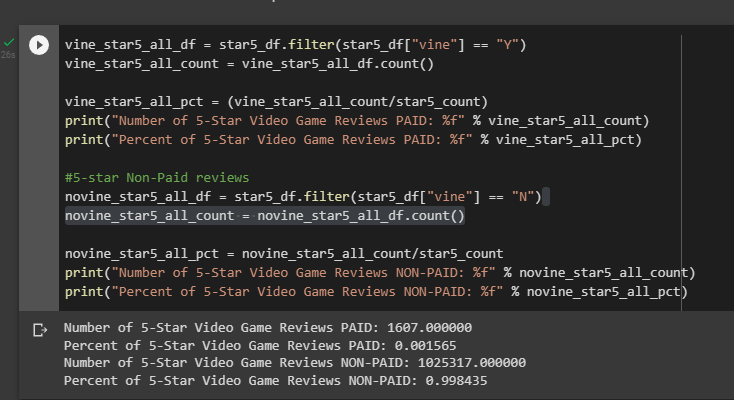

# Amazon-Vine
## Purpose
The purpose of this anaylsis is to determine if there is any bias towards the paid vine members reviews towards the prodcuts they are reviewing. in this instance they are reviewing video games.

## Determining Bias
the difference between vine reviews vs non vine reviews when it comes to video game purchases is staggering.  helpful vine reviews make up only 1.5% of the total video game review market, while non vine helpful reviews make up the other 99% of it. in numbers this is 1607 helpful vine review vs 1,025,317. Furthermore if we look at the 5 star reviews it seems that vine members overwhelming posted a 5 star review on the games that they purchased. what this shows it that when it comes to vine it difficult to say how much of this could be baised with such a small sample size.

## Conlcusion and Summary
with our current data set it is not possible to come to any clear conclusion. With so few vine members reveiwing games it is impossible to say one way or the the other, and any conclusion i make would be supported bad erroneous in the exterme. If we wish for more people to reveiw vine products it would be best to reach out to influences to push the service or have it advertised more prominently. Furthermore a study that can be conducted on people who are purchasing games is if they have ever heard of the amazon vine service in the first place, as many probably never have come across it. 
